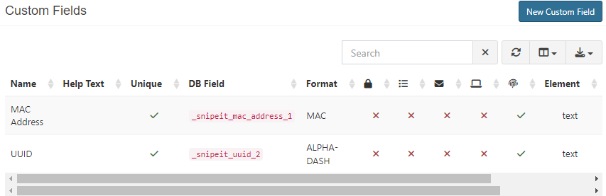

# SnipeAgent

## Overview

SnipeAgent is a work-in-progress project, currently about 65% complete. It aims to provide efficient and automated asset creation and manual asset updating. It still has a long way to go..

## Features

- Creates Asset automatically on first run
- Is able to update the asset it is associated with in the database
- Defaults to default asset model if no corresponding model is found in database

### Prerequisites

- **A Running Snipe-IT instance**
- **A Valid API Key**
- **Every SnipeAgent capable Asset Model has to use a fieldset with the fields MAC and UUID**
    - MAC Custom field is a simple Unique Textbox
    - UUID Custom field is of the format "ALPHA-DASH" which also has to be Uniqe as SnipeAgent uses the UUID to identify its created assets

### Build

git clone https://github.com/DarkZoneSD/SnipeAgent.git 

Edit the EnvVariables.txt file with your environment variables

Dotnet Build

### Goals

- **Simplify the installation process**
- **easier use of the .env file**