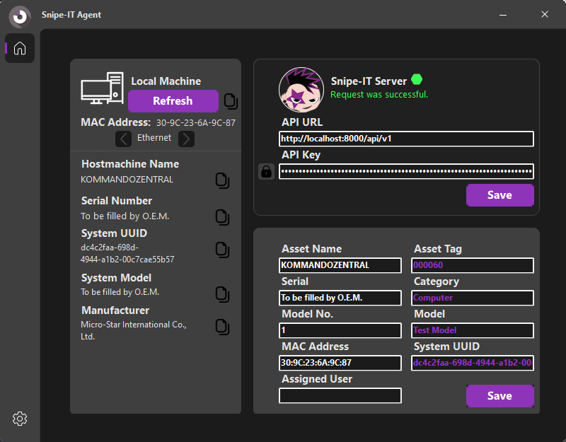

# SnipeAgent

## Overview

SnipeAgent is a work-in-progress project, currently about 60% complete. It aims to provide efficient and automated asset creation and manual asset updating. It still has a long way to go..

## Features

- **Feature 1:** Creates Asset automatically on first run
- **Feature 2:** Is able to update the asset it is associated with in the database

### Prerequisites

-  **A Running Snipe-IT instance**
- **A Valid API Key**

### Installation

TODO

### Goals

- **Simplify the installation process**
- **easier use of the .env file**